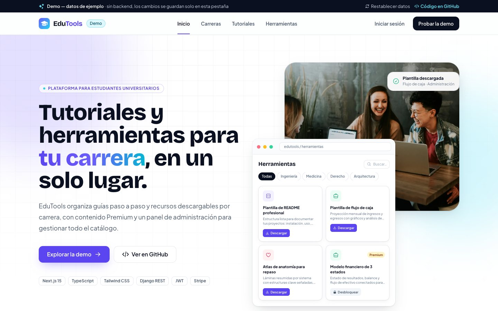
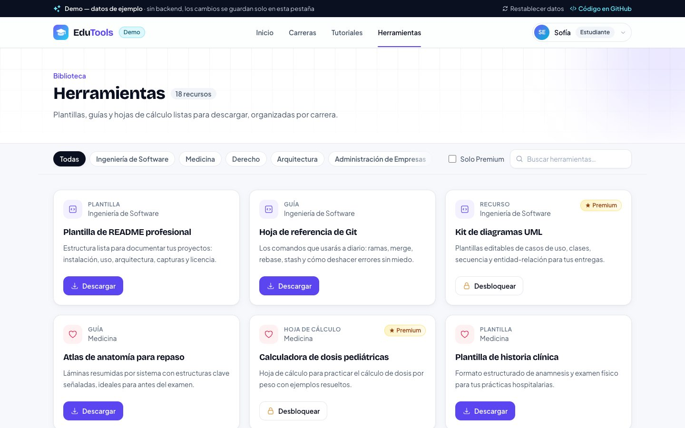
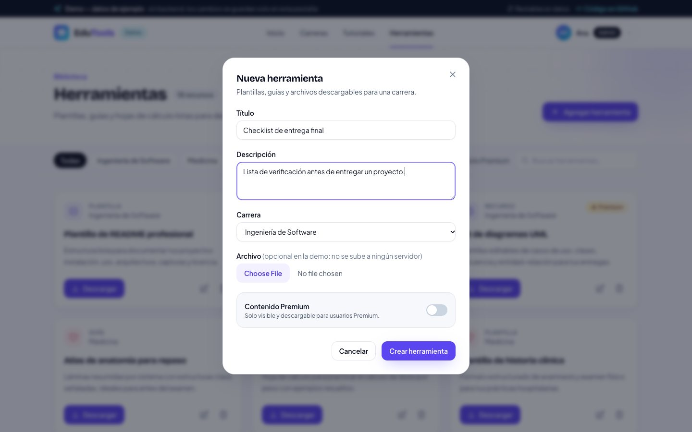
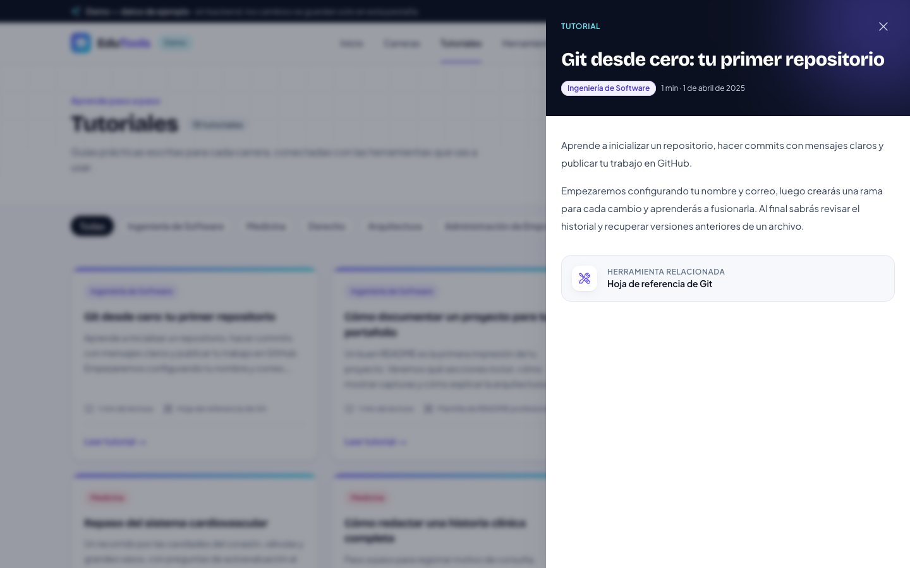
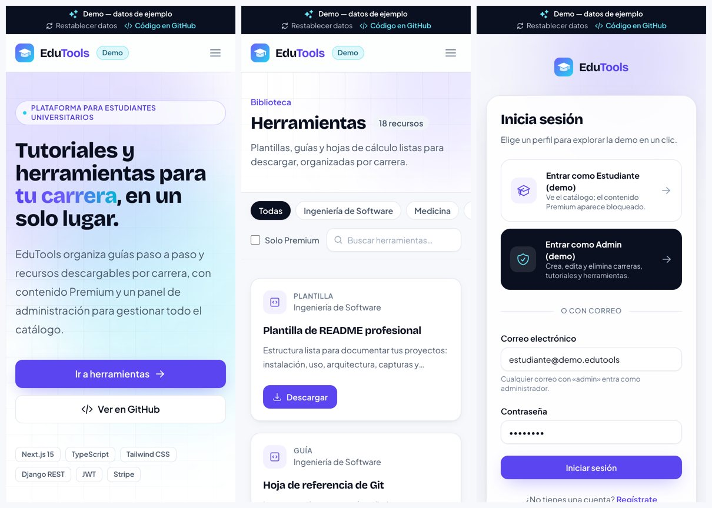
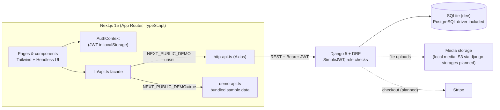

# EduTools

**A learning platform for university students: tutorials and downloadable tools organized by degree program, with admin/student roles and premium content.**
Next.js 15 + TypeScript frontend on top of a Django REST Framework API with JWT auth.

[](https://gustavolarcodev.github.io/EduTools/)

> **About the live demo:** it is a static export of the frontend hosted on GitHub Pages. The Django backend is **not deployed**; a bundled sample-data layer stands in for the API, so every screen works (including admin create/edit/delete) and changes live only in your browser tab. Sign in with one click as **Student** or **Admin**. The UI is in Spanish.



| Tools grid (student view, premium items locked) | Admin CRUD modal |
| --- | --- |
|  |  |

| Tutorial reader | Mobile |
| --- | --- |
|  |  |

## Features

- **Careers, tutorials and tools.** Content is grouped by degree program. Pages have a career filter (kept in the URL, e.g. `/tools?career=1`), instant search and a "premium only" toggle.
- **Role-based access.** JWT authentication with `admin` and `client` roles. Admins get create/edit/delete for careers, tools (multipart file upload) and tutorials; students browse and download.
- **Premium content.** Tools and tutorials can be flagged premium. The API filters them out for non-premium users, and the UI shows locked cards and an upgrade dialog. The data model has a `Subscription` entity and a checkout endpoint placeholder for Stripe.
- **Tutorial reader.** A slide-over panel shows the full tutorial with reading time, the related tool and an optional video link.
- **Polished UX.** Skeleton loaders, empty states, confirm dialogs and toasts instead of `alert()`/`confirm()`, and accessible Headless UI menus and dialogs.
- **Accessibility and SEO.** Skip link, landmarks, labelled icon buttons, visible focus rings, `prefers-reduced-motion` support, per-route titles, Open Graph/Twitter cards and an SVG favicon.

## Architecture



The frontend never imports Axios directly from components. Everything goes through `src/lib/api.ts`, which picks the real HTTP client or the in-browser demo implementation at build time. Both expose the same function signatures, which is what lets the same UI run against Django locally and as a static site on GitHub Pages.

### Data model

| Model | Key fields |
| --- | --- |
| `User` (extends `AbstractUser`) | `email`, `role` (`admin` / `client`), `is_premium`, `career`, `google_id` |
| `Career` | `name`, `description` |
| `Tool` | `title`, `description`, `career → Career`, `file`, `is_premium` |
| `Tutorial` | `title`, `content`, `career → Career`, `tool → Tool` (optional), `video_url`, `is_premium` |
| `Subscription` | `user → User`, `stripe_customer_id`, `stripe_subscription_id`, `is_active`, `start_date`, `end_date` |

### Tech stack

| Layer | Technology |
| --- | --- |
| Frontend | Next.js 15 (App Router), React 19, TypeScript, Tailwind CSS 3, Headless UI, Heroicons, Axios |
| Backend | Django 5, Django REST Framework, SimpleJWT, django-filter, django-cors-headers, django-allauth |
| Data | SQLite in development (`psycopg2` included for PostgreSQL) |
| Integrations | Stripe SDK and django-storages/boto3 (S3) in requirements; checkout not wired up yet |
| Demo hosting | Static export (`output: 'export'`) served by GitHub Pages from `/docs` |

## Project structure

```
backend/            Django project (config/) and the core app (models, serializers, views, urls)
frontend/
  src/app/          Routes: /, /careers, /tools, /tutorials, /auth/login, /auth/register
  src/components/   Layout, views, cards, forms and UI primitives (Modal, Toast, FilterBar…)
  src/lib/          api.ts facade, http-api.ts (Axios), demo-api.ts + demo-data.ts, config.ts
  scripts/          export-demo.mjs: copies the static export into /docs
docs/               Built demo served by GitHub Pages (generated, do not edit)
```

## Running locally

### Backend (API mode)

```bash
cd backend
python -m venv venv && source venv/bin/activate   # Windows: .\venv\Scripts\activate
pip install -r requirements.txt
cp .env.example .env                              # then fill in the values
python manage.py migrate
python manage.py runserver                        # http://localhost:8000/api/
```

> Migration `0004_create_admin_user` seeds a **development-only** admin (`admin@edutools.com`). Change its password or delete it before using the database anywhere public.

### Frontend

```bash
cd frontend
npm install
npm run dev          # API mode: talks to NEXT_PUBLIC_API_URL (default http://localhost:8000/api)
npm run dev:demo     # Demo mode: no backend needed, uses bundled sample data
```

| Variable | Purpose |
| --- | --- |
| `NEXT_PUBLIC_API_URL` | Base URL of the Django API (API mode). |
| `NEXT_PUBLIC_DEMO` | `true` swaps the API for the in-browser sample-data layer and enables the static export. |
| `NEXT_PUBLIC_BASE_PATH` | Path the static site is served from (`/EduTools` on GitHub Pages). |

## How the demo is built

```bash
cd frontend
npm run build:demo
```

1. `NEXT_PUBLIC_DEMO=true NEXT_PUBLIC_BASE_PATH=/EduTools next build`. With the flag set, `next.config.ts` enables `output: 'export'`, `basePath`/`assetPrefix`, `trailingSlash` and unoptimized images. Without the flag the config is untouched, so API mode works as before.
2. `scripts/export-demo.mjs` replaces the repo-root `docs/` with `frontend/out/` and writes `docs/.nojekyll` so GitHub Pages serves the `_next/` folder.
3. GitHub Pages serves `main:/docs` at <https://gustavolarcodev.github.io/EduTools/>.

In demo mode no network requests are made. The sample careers, tools and tutorials live in `src/lib/demo-data.ts`, admin edits persist in `sessionStorage`, and a banner on every page labels the data as sample data, with a button to reset it.

## Roadmap

- Implement the Stripe Checkout session and webhook endpoints (currently stubs), and mark users premium on payment.
- Finish Google OAuth (the endpoint exists but returns *not implemented*).
- Tighten permissions on the tool/tutorial viewsets (currently `AllowAny` for development).
- Configure S3 media storage for uploads in production.
- Add backend tests (DRF API tests) and frontend tests (component + Playwright smoke tests).

## Security notes

- `SECRET_KEY` and `DEBUG` are now read from the environment. A development fallback key is only used when `DEBUG` is on. An older commit contained a hard-coded development key; it was never used in production, and any real deployment must use its own key.
- Never commit `.env` files. `backend/.env.example` lists the variables the settings expect.

---

Portfolio project by **Gustavo Larco**. A Spanish version of the original setup guide is in [README.es.md](README.es.md).
